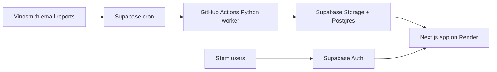

# Next.js Migration Plan

## Goal

Move WineBook from Streamlit-localhost into a hosted Next.js app on Render with Supabase Auth,
while keeping the validated Python ingestion and ordering engine intact.

## Target Architecture



## Phase 1: Read-Only Hosted Shell

- Scaffold `apps/web` with Next.js.
- Use Supabase Auth for Google and email/password login.
- Require a matching `app_profiles` row before data access.
- Read the latest completed report run and recommendation snapshot.
- Recreate the top-level Order Review metrics and supplier sections.
- Add first-pass client filters for supplier, Brand Manager/TDM, search, suggested-only rows, and expand-all workbenches.
- Add buyer/admin autosave for recommended quantity and approval state through Supabase RLS.
- Read current-report PO Drafts with line-count, approved-quantity, wine-cost, laid-in-cost, and estimated-cost rollups.

## Phase 2: Buyer Workflow

- Add filters for supplier, TDM/Brand Manager, search, and suggested-only view.
- Replace the first editable table pass with a proper grid that preserves scroll position under heavier data volume.
- Extend autosave to PO draft creation and draft-line review.
- Add PO Draft create/export/status actions to the Next app.
- Create PO drafts from all approved rows.
- Port PO Draft review and XLSX export using the STM PO template.
- Keep target-weeks editing as follow-up if Mark still wants it in V1.

## Phase 3: Admin / Supplier Hub

- Manage supplier logistics in-app.
- Replace `importers.csv` as a normal operating workflow.
- Keep CSV import/export as an admin backup path.

## Phase 4: Render Deployment

- Create a Render Web Service with root directory `apps/web`, or use the checked-in `render.yaml`.
- Configure Supabase Auth redirect URLs for the Render URL.
- Add production env vars.
- Confirm authenticated access, latest report visibility, and PO Draft workflows.

Required Render environment variables:

```text
NODE_VERSION=20
NEXT_PUBLIC_SITE_URL=https://<render-service-url>
NEXT_PUBLIC_SUPABASE_URL=https://hpnvlxvnzpojpfepcerl.supabase.co
NEXT_PUBLIC_SUPABASE_ANON_KEY=<Supabase anon/publishable key>
```

The web app has its own copy of `templates/po_draft_template_stm.xlsx` under
`apps/web/templates/` so XLSX export works when Render deploys only the web app root.

## Deferred Until After Migration

- DI vs Stateside ordering mode.
- Ant Moore container-mix logic.
- Brand-level DI transit/freight rules.
- Direct deletion/editing of PO draft line items.
- QuickBooks writeback.
