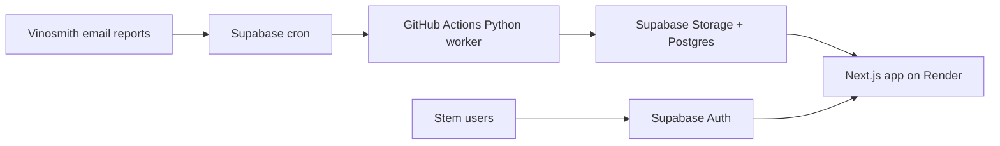

# Next.js Migration Plan

## Goal

Move WineBook from Streamlit-localhost into a hosted Next.js app on Render with Supabase Auth,
while keeping the validated Python ingestion and ordering engine intact.

Status: migration is functionally complete for the V1 buyer workflow. The hosted app is live at
`https://stmhq.com`; Streamlit remains as a reference/fallback implementation.

## Target Architecture



## Phase 1: Read-Only Hosted Shell

- Done: scaffold `apps/web` with Next.js.
- Done: use Supabase Auth for Google and email/password login.
- Done: require a matching `app_profiles` row before data access.
- Done: read the latest completed report run and recommendation snapshot.
- Done: recreate the top-level Order Review metrics and supplier sections.
- Done: add client filters for supplier, Brand Manager/TDM, search, suggested-only rows, and expand-all workbenches.
- Done: add buyer/admin autosave for recommended quantity and approval state through Supabase RLS.
- Done: read current-report PO Drafts with line-count, approved-quantity, wine-cost, laid-in-cost, and estimated-cost rollups.

## Phase 2: Buyer Workflow

- Done: add filters for supplier, TDM/Brand Manager, search, and suggested-only view.
- Done: replace Streamlit data editors with AG Grid tables that preserve scroll position under heavier data volume.
- Done: extend autosave to approval/recommendation edits.
- Done: add PO Draft create/export/status actions to the Next app.
- Done: create PO drafts from all approved rows.
- Done: port PO Draft review and XLSX export using the STM PO template.
- Done: support target-weeks editing and synchronized recommended quantity editing.

## Phase 3: Admin / Supplier Hub

- Done: manage supplier logistics in-app.
- Done: replace `importers.csv` as the normal operating workflow.
- Deferred: keep CSV import/export as an admin backup path.

## Phase 4: Render Deployment

- Done: create a Render Web Service with root directory `apps/web`.
- Done: configure Supabase Auth redirect URLs for the Render URL and production domain.
- Done: add production env vars.
- Done: verify custom domain DNS for `stmhq.com` and `www.stmhq.com`.
- In progress: wait for any pending Render SSL certificate issuance to finish.
- Next QA: confirm authenticated access, latest report visibility, and PO Draft workflows on `https://stmhq.com`.

Required Render environment variables:

```text
NODE_VERSION=20
NEXT_PUBLIC_SITE_URL=https://stmhq.com
NEXT_PUBLIC_SUPABASE_URL=https://hpnvlxvnzpojpfepcerl.supabase.co
NEXT_PUBLIC_SUPABASE_ANON_KEY=<Supabase anon/publishable key>
```

The web app has its own copy of `templates/po_draft_template_stm.xlsx` under
`apps/web/templates/` so XLSX export works when Render deploys only the web app root.

## Deferred After V1 Migration

- DI vs Stateside ordering mode.
- Ant Moore container-mix logic.
- Brand-level DI transit/freight rules.
- QuickBooks writeback.
