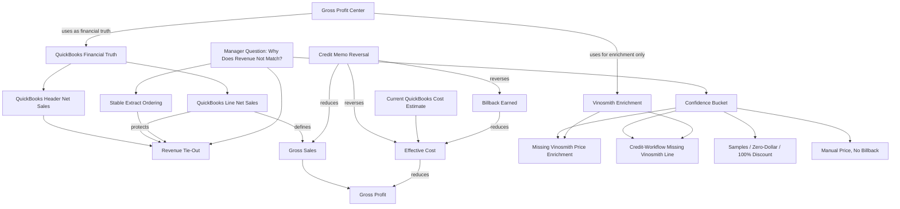

# Gross Profit Center Knowledge Graph

Date: 2026-08-16

This is the first concrete subgraph under the broader [Company Knowledge Graph Seed](../company-knowledge-graph-seed.md). It captures the manager-facing truth model for Gross Profit Center. The app should teach these relationships over time, especially when a manager asks why revenue, credits, billbacks, samples, or confidence buckets do not appear to match at first glance.

The machine-readable seed graph is stored in `docs/quickbooks/gross-profit-center-knowledge-graph.json`.

## Manager Mental Model

Gross Profit Center is not just a margin report. It is a confidence-aware explanation layer:

- QuickBooks is the financial truth.
- Vinosmith is enrichment only.
- Revenue must tie before gross profit is interpreted.
- Every line has a confidence bucket.
- Samples, manual prices, missing enrichment, and credit-workflow artifacts should be explained rather than blended into one opaque number.

## Revenue Tie-Out Rule

For the same date range:

```text
QuickBooks header net sales
= invoice header subtotal - credit memo header subtotal

Gross Profit Center line net sales
= signed invoice line amounts + signed credit memo line amounts
```

These should match within rounding. If they do not, the first question is not "which manager is wrong?" It is "was the extract stable?"

Large paginated extracts must use stable unique ordering. A query can return the expected row count while duplicating some invoices and skipping others if it is paginated without a unique sort key. That produces a fake revenue mismatch.

Current proof result for `2025-01-01` through `2026-08-16`:

- QuickBooks invoice header sales: $17,535,636.99.
- QuickBooks credit memo header sales: $189,081.39.
- QuickBooks header net sales: $17,346,555.60.
- Gross Profit Center line net sales: $17,346,555.60.
- Revenue delta: below $0.01.

## Graph



## Manager Guidance

1. Start with the revenue tie-out.
2. If revenue does not match, check extract stability before assuming the business number is wrong.
3. Treat Vinosmith gaps as enrichment confidence issues unless QuickBooks revenue itself fails the tie-out.
4. Do not mix samples/free goods into normal commercial-margin interpretation.
5. Initial GP is operating/economic GP using current QuickBooks item cost and earned billback, not audited historical COGS.

## Future App Behavior

When a manager clicks a metric or bucket, the app should be able to answer:

- What is the source of truth?
- What enrichment was used?
- What confidence bucket is this?
- Does revenue tie to QuickBooks headers?
- Are credits, samples, manual prices, or missing Vinosmith enrichment affecting the view?
